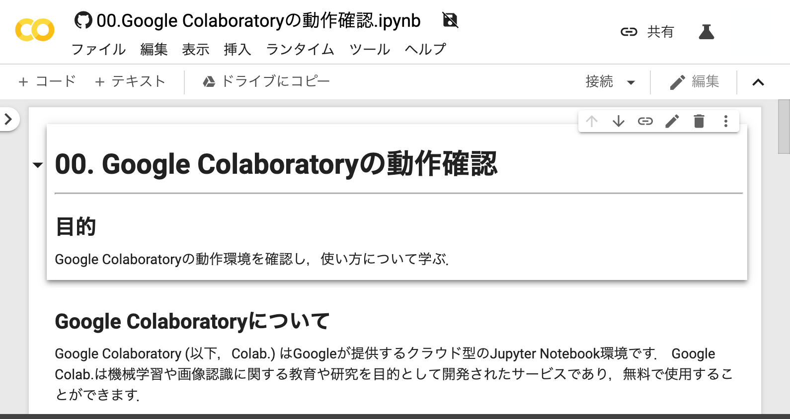

# E-Learning

JDLA のE資格を取得する際に学習した内容のノートブックです。Pythonを一通り、学んだうえでE資格を取得したい場合にご利用ください。

## Google Colabで開くためのリンク

以下は，ノートブックをGoogle Colabで開くためのリンクです．
使用するノートブックのリンクをクリックすると，Google Colabでノートブックが開くので，各自のGoogleドライブへコピーして使用してください．

00. [Google Colaboratoryの動作確認](https://colab.research.google.com/github/TokitsuKotaro/E-Learning/blob/main/notebooks/00_operation_check_of_google_colab.ipynb)

01. [ホールドアウト法によるサポートベクトルマシンの性能評価](https://colab.research.google.com/github/TokitsuKotaro/E-Learning/blob/main/notebooks/01_holdout_svm.ipynb)

01. [主成分分析](https://colab.research.google.com/github/TokitsuKotaro/E-Learning/blob/main/notebooks/02_pca.ipynb)

01. [最急降下法と確率的勾配降下法](https://colab.research.google.com/github/TokitsuKotaro/E-Learning/blob/main/notebooks/03_stochastic_gradient_descent.ipynb)

01. [ニューラルネットワークによる2クラス分類](https://colab.research.google.com/github/TokitsuKotaro/E-Learning/blob/main/notebooks/04_neural_network_Bernoulli.ipynb)

01. [ニューラルネットワークによるMNISTデータセットの認識実験](https://colab.research.google.com/github/TokitsuKotaro/E-Learning/blob/main/notebooks/05_neural_network_multinoulli.ipynb)

01. [im2colを用いた効率的な畳み込み処理](https://colab.research.google.com/github/TokitsuKotaro/E-Learning/blob/main/notebooks/06_im2col.ipynb)

01. [畳み込みニューラルネットワークを用いた画像認識](https://colab.research.google.com/github/TokitsuKotaro/E-Learning/blob/main/notebooks/07_convolutional_neural_network.ipynb)

01. [Dropuot](https://colab.research.google.com/github/TokitsuKotaro/E-Learning/blob/main/notebooks/08_dropout.ipynb)

01. [L2, L1正則化](https://colab.research.google.com/github/TokitsuKotaro/E-Learning/blob/main/notebooks/09_L2L1_regularization.ipynb)

01. [データ集合の拡張](https://colab.research.google.com/github/TokitsuKotaro/E-Learning/blob/main/notebooks/10_data_augmentation.ipynb)

01. [バッチ正規化・レイヤー正規化・インスタンス正規化](https://colab.research.google.com/github/TokitsuKotaro/E-Learning/blob/main/notebooks/11_feature_normalizations.ipynb)

01. [回帰結合型のニューラルネットワーク（RNN）による電力予測](https://colab.research.google.com/github/TokitsuKotaro/E-Learning/blob/main/notebooks/12_rnn.ipynb)

01. [回帰結合型のニューラルネットワーク（LSTM）による電力予測](https://colab.research.google.com/github/TokitsuKotaro/E-Learning/blob/main/notebooks/13_lstm.ipynb)

01. [回帰結合型のニューラルネットワーク（GRU）による電力予測](https://colab.research.google.com/github/TokitsuKotaro/E-Learning/blob/main/notebooks/14_gru.ipynb)

01. [回帰結合型のニューラルネットワークによる文章生成](https://colab.research.google.com/github/TokitsuKotaro/E-Learning/blob/main/notebooks/15_recurrent_neural_network.ipynb)

01. [双方向LSTMによる品詞のタグ付け](https://colab.research.google.com/github/TokitsuKotaro/E-Learning/blob/main/notebooks/16_bi-directional_lstm.ipynb)

01. [Encoder-Decoderによる機械翻訳](https://colab.research.google.com/github/TokitsuKotaro/E-Learning/blob/main/notebooks/17_lstm_encoder_decoder.ipynb)

01. [Residual Networks・Wide Residual Network](https://colab.research.google.com/github/TokitsuKotaro/E-Learning/blob/main/notebooks/18_resnet_wrn.ipynb)

01. [Gradient-weighted Class Activation Mapping (GradCAM)](https://colab.research.google.com/github/TokitsuKotaro/E-Learning/blob/main/notebooks/19_grad_cam.ipynb)

01. [Deep Convolutional GAN (DC-GAN)](https://colab.research.google.com/github/TokitsuKotaro/E-Learning/blob/main/notebooks/20_dcgan.ipynb)

01. [Transformer](https://colab.research.google.com/github/TokitsuKotaro/E-Learning/blob/main/notebooks/31_transformer.ipynb)

01. [Bidirectional Encoder Representations from Transformers (BERT)](https://colab.research.google.com/github/TokitsuKotaro/E-Learning/blob/main/notebooks/32_bert.ipynb)

## Google Colabを用いたノートブックの実行方法

このリポジトリのノートブックをGoogle Colabで実行するためには，実行したいノートブックのURLのうち，`github.com`を`colab.research.google.com/github`に置き換えてアクセスすることで，直接Google Colabで開くことが可能です．
その後，画面上部の「ドライブにコピー」をクリックすることで，自身のGoogle Driveへノートブックがコピーされます．
コピーされたノートブックを開き，実行してください．

